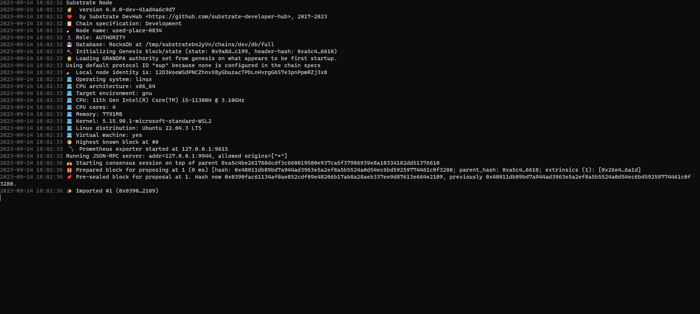
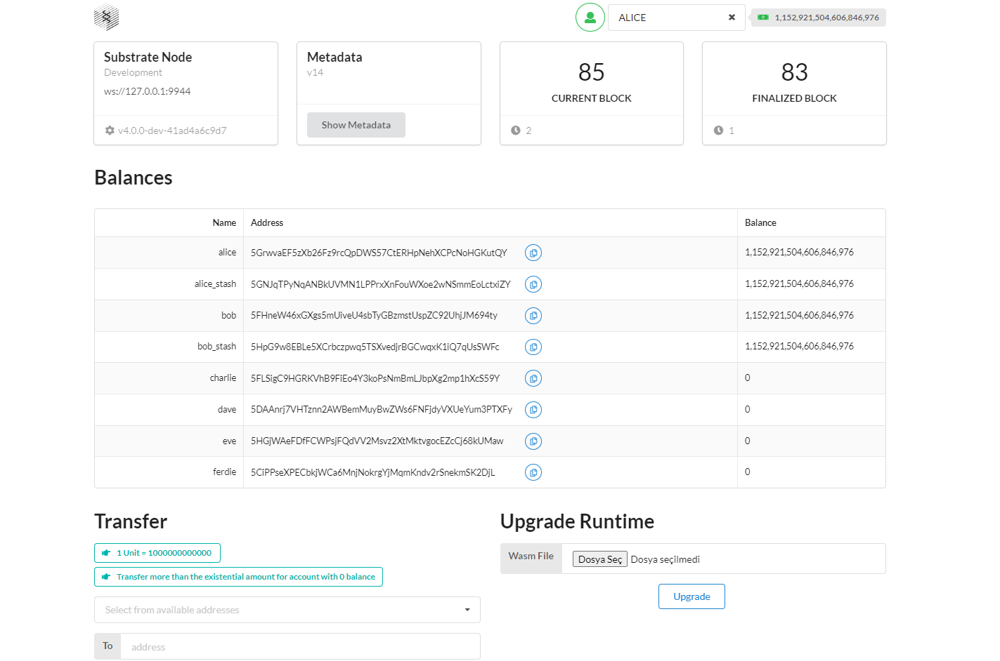
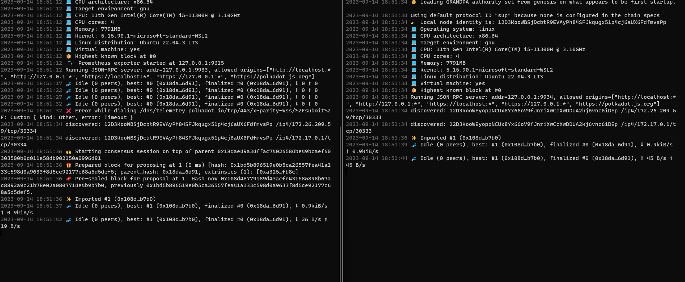

# Polkadot Substrate Development Bootcamp

Welcome to the **Polkadot Substrate Development Bootcamp** final project repository! This repo cotains risein.com Polkadot Substrate Development Bootcamp final project file that include:

1. Building a blockchain
2. Simulating a substrate network
3. Adding trusted nodes to a network
8. Smart contracts

## Table of Contents

- [Overview](#overview)
- [Features](#features)
- [Getting Started](#getting-started)
  - [Prerequisites](#prerequisites)
  - [Installation](#installation)
- [Building a Blockchain](#Building-a-blockchain)
- [Simulating a Substrate Network](#Simulating-a-substrate-network)
- [Smart Contracts](#smart-contracts)
- [Adding Trusted Nodes to a Network](#Adding-trusted-nodes-to-a-network)
- [Smart Contracts](#Smart-contracts)

## Overview

Polkadot Substrate is a highly flexible and modular blockchain development framework that allows developers to build custom blockchains and decentralized applications (dApps) with ease. Smart contract development on Polkadot Substrate is a powerful way to create self-executing contracts that can automate various processes within the blockchain ecosystem. Here's an overview of the steps and components involved in Polkadot Substrate smart contract development:

1. **Understanding Polkadot and Substrate:**
   - Polkadot is a multi-chain network that connects multiple blockchains, allowing them to interoperate.
   - Substrate is a framework for building custom blockchains and parachains (custom blockchains within the Polkadot ecosystem).
   - To develop smart contracts on Polkadot Substrate, it's essential to have a good grasp of both Polkadot's architecture and Substrate's framework.

2. **Set Up Your Development Environment:**
   - Install the necessary development tools, including Rust, the Rust package manager (Cargo), and the Substrate development environment.

3. **Select a Parachain or Create Your Own:**
   - You can either build a standalone blockchain using Substrate or create a parachain that connects to the Polkadot relay chain. Parachains have the advantage of being part of the Polkadot network, enabling cross-chain interoperability.

4. **Choose a Smart Contract Development Language:**
   - Substrate supports multiple smart contract languages, with Rust being the most popular choice. Other options include Solidity and Ink! (a Rust-based smart contract language specifically designed for Substrate).

5. **Develop Your Smart Contract:**
   - Write your smart contract code using the chosen language. You'll define the contract's logic, state variables, and functions.

6. **Compile and Test Your Smart Contract:**
   - Use the Substrate development tools to compile your smart contract code into WebAssembly (Wasm). Test your smart contract on a local Substrate development chain to ensure it behaves as expected.

7. **Integration with Substrate Runtime:**
   - Integrate your smart contract into the Substrate runtime. This involves adding your contract to the runtime's logic and storage.

8. **Deploy Your Parachain or Chain:**
   - Deploy your custom blockchain or parachain to the Polkadot network. This step involves configuring and launching your blockchain, ensuring it connects to the Polkadot relay chain.

9. **Interact with Smart Contracts:**
   - Users can interact with your smart contracts through various means, such as sending transactions and invoking contract functions. Interactions can be done using Polkadot.js (a JavaScript library) or other suitable tools.

10. **Monitor and Maintain Your Network:**
    - Regularly monitor your blockchain or parachain for issues and perform necessary maintenance tasks. This includes updating the runtime, fixing bugs, and upgrading the network as needed.

11. **Security and Auditing:**
    - Conduct security audits and code reviews to ensure the safety and reliability of your smart contracts and blockchain.

12. **Community and Governance:**
    - Engage with the Polkadot and Substrate communities to get feedback, share knowledge, and participate in the governance of your chain.

## Features

Substrate is a blockchain development framework created by Parity Technologies, and it offers a wide range of features and capabilities that make it a powerful choice for building custom blockchains and decentralized applications (dApps). Here are some of the key features of Substrate:

1. **Modular Architecture:** Substrate is designed with a modular architecture, allowing developers to customize and build blockchains with only the components they need. This modularity promotes flexibility and scalability.

2. **Runtime Customization:** Substrate provides a runtime development framework, allowing developers to define the core logic and rules of their blockchain. This runtime logic can be upgraded without forking the chain, enhancing adaptability.

3. **Consensus Agnostic:** Substrate is consensus-agnostic, meaning you can choose and implement your preferred consensus algorithm. It supports various consensus mechanisms, including proof-of-stake (PoS), proof-of-authority (PoA), and more.

4. **Cross-Chain Compatibility:** Substrate is designed to enable interoperability between chains. Developers can create parachains (custom blockchains) that can connect to the Polkadot network, facilitating cross-chain communication and asset transfers.

5. **Built-in Networking:** Substrate includes built-in peer-to-peer networking features, making it easier to connect nodes and establish a network for your blockchain.

6. **Consensus and Incentives:** Substrate provides tools for creating economic models and incentive structures, allowing developers to design tokenomics and rewards systems tailored to their blockchain's needs.

7. **Security Features:** Substrate includes security features such as runtime sandboxes, WebAssembly (Wasm) execution, and a strong emphasis on security best practices to protect against vulnerabilities.

8. **Support for Multiple Development Languages:** Substrate supports multiple programming languages for smart contract development, including Rust (with Frame) and Solidity (via integration with EVM).

9. **Forkless Upgrades:** Substrate allows for seamless, forkless runtime upgrades, ensuring minimal disruption to the blockchain's operations when implementing changes or improvements.

10. **Developer-Friendly Tools:** Substrate provides a comprehensive set of developer tools, including Substrate Node Template, Substrate Front-End Template, and Polkadot JS API, to simplify the development and deployment process.

11. **Community and Ecosystem:** Substrate has a growing and active developer community, as well as a thriving ecosystem of projects, libraries, and resources that can accelerate development and provide support.

12. **Governance Framework:** Substrate includes a governance framework that allows token holders to propose and vote on changes to the blockchain's parameters, making it a self-evolving and community-driven platform.

13. **Cross-Platform Compatibility:** Substrate is designed to be cross-platform, enabling developers to run their blockchain nodes on various operating systems, including Linux, Windows, and macOS.

14. **Integration with Polkadot:** Substrate is closely integrated with the Polkadot network, making it easier for developers to build parachains that can connect to the Polkadot relay chain and take advantage of Polkadot's security and interoperability features.

These features make Substrate a versatile and powerful framework for building custom blockchains and dApps tailored to specific use cases and requirements, whether it's for financial services, supply chain management, gaming, or any other application of blockchain technology.

## Getting Started

Follow these steps to set up the project locally and start participating in web3 auctions.

### Prerequisites

To run and building the web3 project over Polkadot substrate, we need to install rust and it's dependencies.

### Installation

1. to install Rust and Cargo you can follow the instructions on the website:

```bash
  https://docs.substrate.io/install/
```

2. Then, clone the repository:

Note: in tihs project I'm using Polkadot v1.0.0. Some instructions and commands may changes.

```bash
  git clone https://github.com/substrate-developer-hub/substrate-node-template
```
3. Install Yarn and Node.js

```bash
# Install Nodejs
curl -sL https://deb.nodesource.com/setup_14.x | sudo -E bash - &&
sudo apt update &&
sudo apt install nodejs &&
sudo apt install build-essential

# Install Yarn
curl -sS https://dl.yarnpkg.com/debian/pubkey.gpg | sudo apt-key add - && 
echo "deb https://dl.yarnpkg.com/debian/ stable main" | sudo tee /etc/apt/sources.list.d/yarn.list &&
sudo apt update &&
sudo apt install yarn &&
```

## Building a Blockchain

**1. It’s a good idea to always create a new branch.**

```bash
 git switch -c tutorial
```

**2. Build and run the project.**

```bash
 cargo build --release
```
After builiding is completed to run the project.

```bash
 ./target/release/node-template --dev
``` 
    The –dev flag indicates that we want the node to run in development mode. This option is great during development because it deletes all active data such as keys, blockchain database and networking information when you stop the node.

    After running the project your terminal should seems like this:


**3. Front-end template.**

The front-end template uses ReactJS to render a web browser interface that enables you to interact with the Substrate-based blockchain node. You can use this Front-end template as a starting point for creating user interfaces for your own projects in future.

```bash
    cd substrate-front-end-template
```

Now we will install the project using yarn.

```bash        
    yarn install
```

And now we just have to start the front end with the following command.
    
```bash        
    yarn start
```
This page should be opened automatically.


## Simulating a Substrate Network

**1. Starting the node**

if you run the project as a node before, you may want to remove old datas. if you didn't, you can pass.

```bash
./target/release/node-template purge-chain --base-path /tmp/alice --chain local
```

Start the local blockchain node using the “alice” account by running the following command. You should observe the terminal to see if all is going well and there are no errors.


```bash

./target/release/node-template 

--base-path /tmp/alice 

--chain local 

--alice 

--port 30333 

--rpc-port 9933 

--node-key 0000000000000000000000000000000000000000000000000000000000000001 

--telemetry-url "wss://telemetry.polkadot.io/submit/ 0" 

--validator

```

**2. Adding another node**

```bash
./target/release/node-template 

--base-path /tmp/bob 

--chain local 

--bob 

--port 30334  

--rpc-port 9934 

--telemetry-url "wss://telemetry.polkadot.io/submit/ 0" 

--validator 

--bootnodes /ip4/127.0.0.1/tcp/30333/p2p/12D3KooWEyoppNCUx8Yx66oV9fJnriXwCcXwDDUA2kj6vnc6iDEp
```

You can see the data transmission between two nodes, Also, they are running on local network.

Now that both the nodes are running, all you need to do is observe whether both the terminals are showing the same messages, you will see similar lines in the terminals.

You will see that node identity was discovered and the node has 1 peer where peer is the other node that we have started.

You can then shut down one of the nodes by pressing control+c and you will see that the first node will have 0 peers remaining.

## Adding Trusted Nodes to a Network

## Smart Contracts
